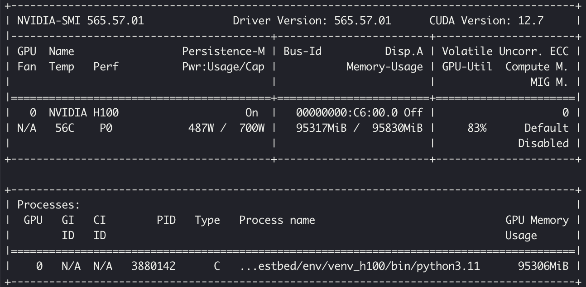
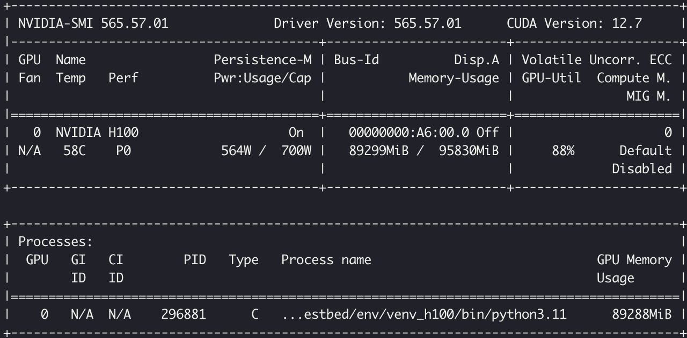

# Aurora test bed
Training and inference of Aurora model on NVIDIA H100 GPUs. 

## Training results (DDP 1 GPU)
Script `train_1gpu.sh`. Logs can be found in `logs/train/1gpu`.

Note: `N=5` in `train.py`
| `option` | `job_id` |`num_epochs` | `small` | `bf16` | `autocast` |  `checkpointing_module_names`  | Error | When |
|-|-|-|-|-|-|-|-|-|
|0|13098829|500|true|false|false|all|None|NA|
|1|13098831|500|true|true|false|all|[rank0]: RuntimeError: CUDA error: an illegal memory access was encountered [rank0]: Compile with `TORCH_USE_CUDA_DSA` to enable device-side assertions.|`loss.backward()` at first batch of first epoch|
|2|13098833|500|true|false|true|all|[rank0]: RuntimeError: CUDA error: an illegal memory access was encountered [rank0]: Compile with `TORCH_USE_CUDA_DSA` to enable device-side assertions.|`loss.backward()` at first batch of first epoch|
|3|13098835|500|true|true|true|all|[rank0]: RuntimeError: CUDA error: an illegal memory access was encountered [rank0]: Compile with `TORCH_USE_CUDA_DSA` to enable device-side assertions.|`loss.backward()` at first batch of first epoch|
|4|13098837|500|true|false|true|Basic3DEncoderLayer Basic3DDecoderLayer|[rank0]: RuntimeError: CUDA error: an illegal memory access was encountered [rank0]: Compile with `TORCH_USE_CUDA_DSA` to enable device-side assertions.|`loss.backward()` at first batch of first epoch|
|5|13098840|500|false|false|false|all|Fail without error message. Loss is NaN though. Likely OOM.|During 33rd steps (epoch 7, batch 3)|
|6|13098842|500|false|true|false|all|[rank0]: RuntimeError: CUDA error: an illegal memory access was encountered [rank0]: Compile with `TORCH_USE_CUDA_DSA` to enable device-side assertions.|`loss.backward()` at first batch of first epoch|
|7|13098860|500|false|false|true|all|[rank0]: RuntimeError: CUDA error: an illegal memory access was encountered [rank0]: Compile with `TORCH_USE_CUDA_DSA` to enable device-side assertions.|`loss.backward()` at first batch of first epoch|
|8|13098862|500|false|true|true|all|[rank0]: RuntimeError: CUDA error: an illegal memory access was encountered [rank0]: Compile with `TORCH_USE_CUDA_DSA` to enable device-side assertions.|`loss.backward()` at first batch of first epoch|
|9|13098866|500|false|false|true|Basic3DEncoderLayer Basic3DDecoderLayer|[rank0]: RuntimeError: CUDA error: an illegal memory access was encountered [rank0]: Compile with `TORCH_USE_CUDA_DSA` to enable device-side assertions.|`loss.backward()` at first batch of first epoch|

### Observations
- Regardless of the number of parameters (small or large model), **the mixed precision options simply do not work**. 
- Option 5 is strange. The fact that we can perform 32 training steps with the large model without any mixed precision and suddenly fail indicates that there might be some **GPU memory accumulation somewhere in the model**.

### What can we do?
- Move to FSDP, PP, TP? 
- How did Microsoft manage?

## Inference results (1 GPU)
Script `infer_1gpu.sh`. Logs can be found in `logs/infer/1gpu`.

Note: `N=100` in `infer.py`.

### Observations
- Overall, inference on 1 GPU seems to work.
- `bf16` + `autocast` + `small` does not work.
- GPU resources utilisation is strange. The small model uses more memory?
    - **Small model snapshot**
    
    - **Large model snapshot**
    

## Inference results (2GPUs)
Script `infer_2gpus.sh`. Logs can be found in `logs/infer/2gpus`.
```
...
Batch [4/50]: 100%|██████████| 196/196 [05:38<00:00,  1.73s/it]
Batch [3/50]:  89%|████████▉ | 174/196 [07:59<01:03,  2.89s/it]
[rank0]: Traceback (most recent call last):
[rank0]: torch.OutOfMemoryError: CUDA out of memory. Tried to allocate 3.21 GiB. GPU 0 has a total capacity of 93.11 GiB of which 3.15 GiB is free. Process 569641 has 73.59 GiB memory in use. Including non-PyTorch memory, this process has 16.36 GiB memory in use. Of the allocated memory 15.64 GiB is allocated by PyTorch, and 50.30 MiB is reserved by PyTorch but unallocated. If reserved but unallocated memory is large try setting PYTORCH_CUDA_ALLOC_CONF=expandable_segments:True to avoid fragmentation.  See documentation for Memory Management  (https://pytorch.org/docs/stable/notes/cuda.html#environment-variables)
...
```

### Observations
- SLOWER than 1GPU and does not work!
- Again, it breaks after many steps, which could indicate some **memory accumulation!**
- We should just run multiple independent scripts. 

## Known issues
```
RuntimeError: CUDA error: CUBLAS_STATUS_INTERNAL_ERROR when calling `cublasGemmEx( handle, opa, opb, m, n, k, &falpha, a, CUDA_R_16BF, lda, b, CUDA_R_16BF, ldb, &fbeta, c, CUDA_R_16BF, ldc, compute_type, CUBLAS_GEMM_DEFAULT_TENSOR_OP)`
```
**Solution:** Add `export CUDA_LAUNCH_BLOCKING=1` to SLURM script.